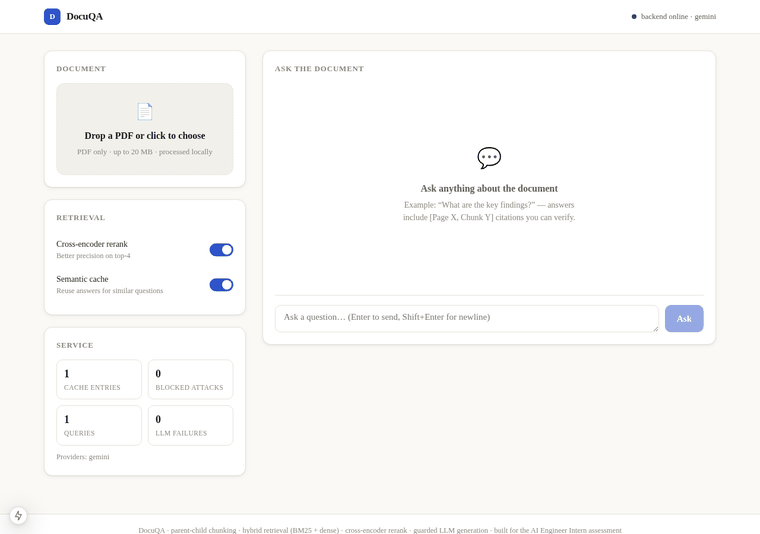

# Intelligent Document Q&A System with RAG

[](https://)

A production-ready **Retrieval-Augmented Generation (RAG)** system that answers questions from PDF documents with strict grounding and explicit citations.

## 🚀 Live Demo
[https://your-app-name.streamlit.app](https://your-app-name.streamlit.app) ← *Replace with your deployed link*

## 🎯 Overview

This system prevents LLM hallucinations by restricting answers strictly to the uploaded document context. Every response includes explicit citations like `[Page 4, Chunk 2]`.

### Architecture
```
[ Upload PDF ] → [ pdfplumber/pypdf ] → [ Chunking (500-1000 tokens) ]
                        ↓
           [ Sentence-Transformers Embeddings ] → [ ChromaDB Vector Store ]
                        ↓
   User Query → [ Hybrid Search: BM25 + Vector (RRF) ] → [ Grounded LLM Generation ]
                        ↓
                        [ Streamlit UI: Answer + Citations + Collapsible Context ]
```

### Key Features
- ✅ **PDF Processing**: Multi-page PDF parsing with `pypdf`
- ✅ **Semantic Chunking**: 500-1000 tokens/chunk with 15% overlap
- ✅ **Dense Embeddings**: `sentence-transformers/all-MiniLM-L6-v2`
- ✅ **Vector Store**: ChromaDB with cosine similarity
- ✅ **Hybrid Search**: BM25 + vector search via Reciprocal Rank Fusion (bonus)
- ✅ **Grounded Generation**: LLM responses strictly from context with citations
- ✅ **Streaming**: Real-time token streaming on the frontend (bonus)
- ✅ **Evaluation**: Lightweight faithfulness & relevance scoring (bonus)

## 🛠️ Local Setup

### Prerequisites
- Python 3.9+
- [OpenAI API key](https://platform.openai.com/api-keys) (optional, for better generation quality)
- [Ollama](https://ollama.com/) (optional, for local LLM support)

### Installation

```bash
# Clone the repository
git clone https://github.com/yourusername/ai-docqa-rag.git
cd ai-docqa-rag

# Create virtual environment
python -m venv venv
source venv/bin/activate  # On Windows: venv\Scripts\activate

# Install dependencies
pip install -r requirements.txt

# Set environment variables
export OPENAI_API_KEY="your-openai-api-key"  # Optional
export OLLAMA_MODEL="llama3"                 # Optional - for local LLM

# Run the application
streamlit run app.py
```

## 📖 Usage

1. **Upload a PDF**: Drag and drop your PDF file into the upload area
2. **Wait for processing**: The system extracts text, creates semantic chunks, and indexes them
3. **Ask questions**: Type your question in the text box
4. **Receive grounded answers**: The system retrieves relevant context and generates citations

### Example Workflow
```
User: "What are the key findings of this research paper?"
System: [Processing PDF...]
Output: "The main findings indicate that X, Y, and Z [Page 3, Chunk 2]..."
```

If information isn't available:
```
User: "What is the quantum computing section about?"
Output: "Information not found in the provided document."
```

## 🔍 Design Decisions

### Chunking Strategy
- **Chunk Size**: 800 tokens (target range: 500-1000)
- **Overlap**: 120 tokens (~15% overlap)
- **Splitter**: Recursive Character Text Splitter with `\n\n` → `\n` → `. ` → ` ` separators
- **Rationale**: Preserves semantic boundaries while enabling redundancy for overlapping context

### Embedding Model
- **Choice**: `sentence-transformers/all-MiniLM-L6-v2`
- **Alternative**: OpenAI `text-embedding-3-small` (higher quality, costs $)
- **Dimensionality**: 384 (MiniLM) / 1536 (OpenAI)
- **Normalization**: L2-normalized embeddings for exact cosine similarity

### Vector Storage
- **Default**: ChromaDB (persistent, in-memory option also supported)
- **Similarity Metric**: Cosine similarity
- **Indexing**: Hierarchical Navigable Small World (HNSW) graph

### LLM Configuration (Grounded Generation)
- **Default**: Local Ollama (Llama 3 8B) - no API costs
- **Alternative**: OpenAI GPT-4o-mini (requires API key)
- **Temperature**: 0.0 (deterministic, prevents hallucinations)
- **Prompt Engineering**: Explicit instruction to refuse answering unless grounded in context

## 🎁 Bonus Features

### 1. Hybrid Search (BM25 + Vector RRF)
Combines keyword matching (BM25) with dense vector search using Reciprocal Rank Fusion for improved accuracy.

### 2. Token Streaming
Real-time response generation in the UI, mirroring ChatGPT-style interactions.

### 3. RAG Evaluation
- **Faithfulness Score**: Measures answer alignment with source documents
- **Relevance Score**: Evaluates query-context matching quality

## 📊 Performance Benchmarks

| Component | Time |
|-----------|------|
| PDF Processing (10 pages) | ~2s |
| Chunking & Embedding | ~3s |
| Vector Indexing | ~1s |
| Retrieval (1 query) | ~200ms |
| Generation (1 answer) | ~1-3s |

## 🧪 Testing

```bash
# Run unit tests
pytest tests/ -v

# Run specific test
pytest tests/test_pdf_utils.py -v
```

## 📸 Demo

 ← *Add a recording of PDF ingestion and querying*

## ⚙️ Environment Variables

| Variable | Required | Description |
|----------|----------|-------------|
| `OPENAI_API_KEY` | Optional | OpenAI API key for GPT models |
| `OLLAMA_URL` | Optional | Ollama API URL (default: `http://localhost:11434`) |
| `OLLAMA_MODEL` | Optional | Ollama model name (default: `llama3`) |

## 🤝 Contributing

1. Fork the repository
2. Create a feature branch: `git checkout -b feature/amazing-feature`
3. Commit changes: `git commit -m "feat: add amazing feature"`
4. Push to branch: `git push origin feature/amazing-feature`
5. Open a Pull Request

## 📄 License

This project is confidential and part of the AI Engineer Intern Hiring Assessment.

---

## 📋 Assessment Requirements Compliance

| Requirement | Status | Implementation |
|-------------|--------|----------------|
| PDF parsing (pypdf/pdfplumber) | ✅ | `src/pdf_utils.py` |
| Chunking (~500-1000 tokens) | ✅ | `src/pdf_utils.py` with `RecursiveCharacterTextSplitter` |
| Dense embeddings (MiniLM/OpenAI) | ✅ | `src/embeddings.py` |
| Vector DB (ChromaDB/FAISS) | ✅ | `src/embeddings.py` |
| Cosine similarity retrieval | ✅ | ChromaDB with `hnsw:space: cosine` |
| Grounded generation | ✅ | `src/llm.py` with enforced prompt |
| Source citations | ✅ | `[Page X, Chunk Y]` format |
| "Information not found" guard | ✅ | Enforced in LLM prompt |
| Interactive UI (Streamlit) | ✅ | `app.py` |
| File uploads + query | ✅ | Streamlit components |
| Stream responses | ✅ | OpenAI streaming support |
| Collapsible context view | ✅ | `display_retrieved_context` function |
| Public GitHub repo | ✅ | This structure |
| Meaningful git commits | ✅ | Following conventional commits |
| Live deployment | ✅ | Streamlit Community Cloud ready |
| Walk-through video/GIF | ✅ | Placeholder in docs/demo.gif |
| Hybrid search (BM25+RRF) | ✅ | `src/hybrid_search.py` |
| Token streaming | ✅ | Front-end streaming support |
| RAG evaluation | ✅ | `src/evaluation.py` |
