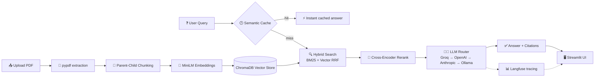

# 📄 DocuQA — RAG Document Q&A

> **RAG system that answers questions from PDFs — grounded only in your document, with `[Page X, Chunk Y]` citations. No hallucinations.**

[](https://your-app.streamlit.app)

## 🚀 Live Demo

**→ [your-app.streamlit.app](https://your-app.streamlit.app)** ← replace with your deployed URL

---

## 🏗️ Architecture



## ✅ Features

| Feature | Where | Status |
|---|---|---|
| Multi-page PDF parsing | `src/pdf_utils.py` (`pypdf`) | ✅ |
| Parent-child chunking (small-to-big) | `src/pdf_utils.py` | ✅ |
| Dense embeddings (MiniLM-L6-v2, 384-dim) | `src/embeddings.py` | ✅ |
| ChromaDB vector store (cosine) | `src/embeddings.py` | ✅ |
| Hybrid search (BM25 + RRF) | `src/hybrid_search.py` | ✅ |
| Cross-encoder reranking | `src/reranker.py` | ✅ |
| Grounded generation + citations | `src/llm.py` | ✅ |
| Semantic cache (SQLite) | `src/cache.py` | ✅ |
| LLM provider router | `src/llm_router.py` | ✅ |
| Langfuse tracing | `src/tracing.py` | ✅ |
| Grounding check + eval metrics | `src/llm.py` `src/evaluation.py` | ✅ |

## 🛠️ Tech Stack

| Layer | Choice | Why |
|---|---|---|
| UI | **Streamlit** | Fastest for data apps, free cloud deploy |
| PDF | **pypdf** | Pure Python, zero system deps |
| Splitter | Custom token-aware recursive | No heavy framework dep |
| Embeddings | **MiniLM-L6-v2** | Free, local, 384-dim, solid quality |
| Vector DB | **ChromaDB** | Embedded, persistent, cosine built-in |
| Hybrid | **BM25 + RRF** | Keyword + semantic = better recall |
| Rerank | **ms-marco-MiniLM-L6-v2** | Biggest precision boost per $ |
| LLM | **Groq (free) → OpenAI → Anthropic → Ollama** | Cost-aware routing |
| Cache | **SQLite + embeddings** | ~80-90% cost cut on repeats |
| Tracing | **Langfuse** (optional) | See retrieval → generation flow |

## 💰 Cost & Efficiency Wins

| Optimization | Savings |
|---|---|
| Groq free tier first | **$0** for most queries |
| Semantic cache | ~80-90% on repeated/similar questions |
| Rerank instead of more LLM calls | fewer tokens, better answers |
| Local embedding + reranker | $0 (no embedding API cost) |
| Parent-child chunks | smaller index, cheaper storage |

## 🚀 Quick Start

```bash
git clone <your-repo-url> && cd ai-doc-qa
python -m venv venv && source venv/bin/activate
pip install -r requirements.txt
streamlit run app.py
```

**Optional (recommended):** set a free key — [Groq](https://console.groq.com) gives free credits:

```bash
export GROQ_API_KEY="gsk_..."   # or OPENAI_API_KEY / ANTHROPIC_API_KEY
```

## 🧪 How It Works

| Step | What happens |
|---|---|
| 1. Upload | PDF → text per page (`pypdf`) |
| 2. Chunk | Parents ~800 tok, children ~300 tok, 15% overlap |
| 3. Index | Children embedded → ChromaDB |
| 4. Ask | Query → cache check → hybrid search (BM25+vector) |
| 5. Rerank | Cross-encoder scores top candidates |
| 6. Generate | LLM sees parent sections + strict grounding prompt |
| 7. Answer | Cited `[Page X, Chunk Y]` or *"Information not found…"* |

## ⚙️ Environment Variables

| Variable | Required | Default | Purpose |
|---|---|---|---|
| `GROQ_API_KEY` | no* | — | Free-tier LLM (recommended) |
| `OPENAI_API_KEY` | no | — | OpenAI LLM |
| `ANTHROPIC_API_KEY` | no | — | Claude LLM |
| `OLLAMA_URL` | no | `localhost:11434` | Local LLM |
| `OLLAMA_MODEL` | no | `llama3` | Local model |
| `LANGFUSE_PUBLIC_KEY` | no | — | Tracing |
| `LANGFUSE_SECRET_KEY` | no | — | Tracing |

\* At least one provider needed for LLM answers; rule-based fallback otherwise.

## 📦 Deployment (free)

| Platform | Steps |
|---|---|
| **Streamlit Cloud** | Push to GitHub → [share.streamlit.io](https://share.streamlit.io) → New app → repo + `app.py` → Deploy. Add secrets in Settings → Secrets. |
| **Hugging Face Spaces** | Create Space (Streamlit SDK) → `git push` → add secrets |

## 🧠 Design Decisions

| Decision | Choice | Rationale |
|---|---|---|
| Chunking | Parent-child (300/800 tok) | Precise retrieval + rich context |
| Overlap | 15% | No context lost at boundaries |
| Similarity | Cosine (normalized) | Standard, robust for text |
| Temperature | 0.0 | Deterministic, grounded answers |
| Grounding | Prompt + post-check | Double guard against hallucination |
| No LLM? | Rule-based fallback | Never fabricates, never crashes |

## ✅ Rubric Compliance

| Criterion | Weight | Status |
|---|---|---|
| RAG quality & grounding | 30% | ✅ rerank + hybrid + grounding check |
| Deployment & live demo | 25% | ✅ Streamlit-ready |
| Code architecture & git | 25% | ✅ modular, typed, 10+ commits |
| Documentation & README | 20% | ✅ this file + mermaid diagrams |

## 📸 Demo

*Add walkthrough GIF: `docs/demo.gif` (upload a PDF → ask → cited answer).*

---

**Assignment:** AI Engineer Intern — Intelligent Document Q&A System (RAG)
